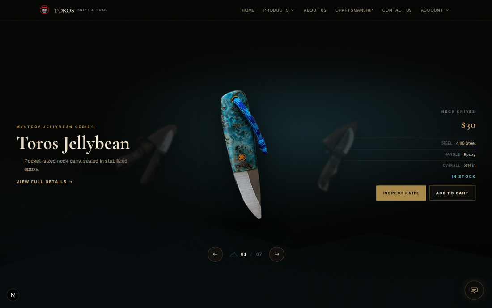
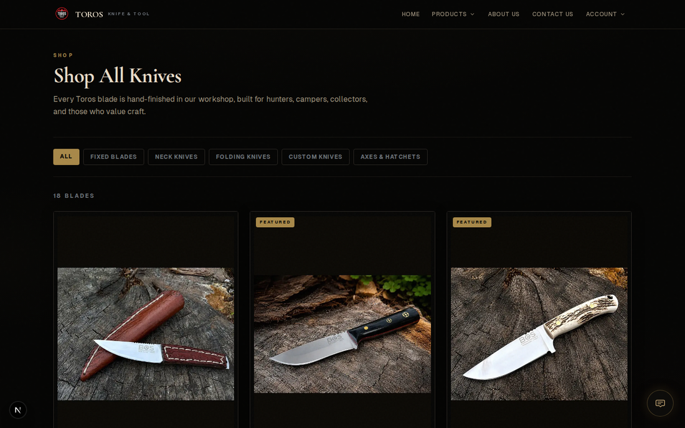
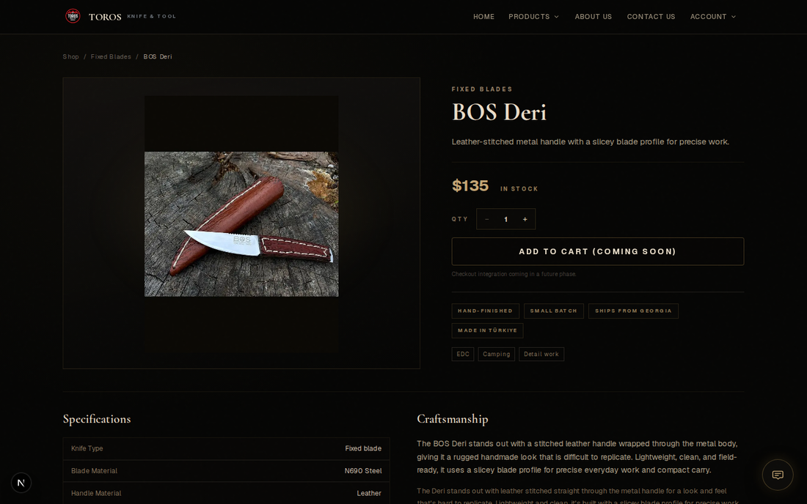
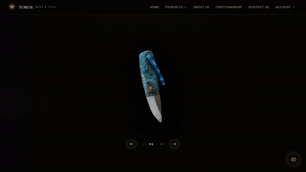
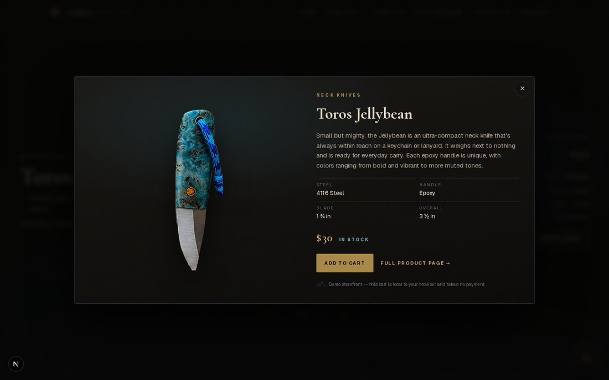
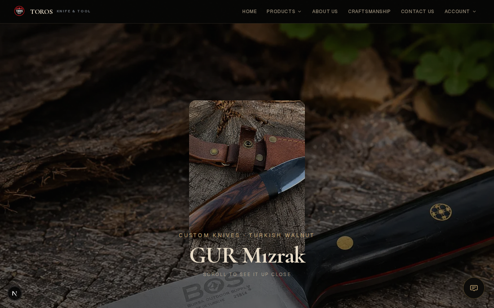

# Toros Knife & Tool

Premium e-commerce storefront for **Toros Knife & Tool** — handcrafted Turkish-inspired blades built for American outdoor adventure.

> *"Toros Knife & Tool bridges centuries-old Turkish bladesmithing with the spirit of American outdoor adventure."*

## Screenshots

| Home | Shop |
| --- | --- |
|  |  |

| Product detail |
| --- |
|  |

**Homepage hero — manual seven-knife carousel (Framer Motion):**



**Closer look (inspection view):**



**Craftsmanship page — scroll-driven media expansion (Framer Motion):**




## Phase 1 (Current)

- Dark premium aesthetic with tan/gold accents
- Mobile-first responsive layout
- Homepage hero: a manual seven-knife carousel with per-product environments and an
  accessible inspection view (no autoplay; arrows, side selection, drag/swipe, arrow keys)
- Shop page with category filtering
- Product detail pages with specs, craftsmanship, care, shipping, and trust sections
- Local product data (`data/products.ts`) — the single source of truth for prices and specs
- Real product photography, plus transparent hero cutouts in `public/images/hero/knives/`
- Craftsmanship page (`/craftsmanship`) with a scroll-driven media expansion hero (Framer Motion)
- Local demo cart behind a swappable `CommerceAdapter` seam (`lib/demo-cart.ts`) — no payment

**Not included in Phase 1:** Knife Finder quiz, 360 viewer, event landing pages, email backend, live checkout.

## Tech Stack

- [Next.js 16](https://nextjs.org/) (App Router)
- React 19 + TypeScript
- Tailwind CSS v4
- [Framer Motion](https://www.framer.com/motion/) for scroll/hover-driven animation

## Getting Started

```bash
cd toros-knife-tool
npm install
npm run dev
```

Open [http://127.0.0.1:3004](http://127.0.0.1:3004) — the `dev` script uses port **3004**, not 3000.

```bash
npm run build   # production build
npm run start   # serve production build
```

## Project Structure

```
toros-knife-tool/
├── app/
│   ├── layout.tsx          # Root layout, fonts, header/footer
│   ├── page.tsx            # Homepage
│   ├── shop/page.tsx       # Shop + category filter
│   ├── craftsmanship/      # Scroll-driven media expansion page
│   ├── about/, contact/, mystery-bag/, cart/, login/, register/
│   └── products/[slug]/    # Product detail (static generation)
├── components/
│   ├── Header.tsx          # Navigation + mobile menu
│   ├── Footer.tsx
│   ├── ProductCard.tsx
│   ├── ProductGallery.tsx
│   ├── ProductImage.tsx    # Real image or placeholder fallback
│   ├── AddToCartButton.tsx # Checkout URL or placeholder CTA
│   ├── home/
│   │   ├── Hero.tsx        # Server wrapper — resolves the featured products
│   │   └── hero/           # Carousel client island, environments, inspection
│   └── ui/                 # Button, SectionHeader, ScrollExpandMedia
├── data/products.ts        # Product catalog (edit here)
├── lib/products.ts         # Data access helpers
├── lib/demo-cart.ts        # Demo commerce adapter (no payment)
├── docs/                   # Hero product + asset audits
└── types/product.ts        # TypeScript product model
```

## Replacing Placeholder Product Data

### 1. Edit product entries

Open `data/products.ts`. Each product supports:

| Field | Description |
|-------|-------------|
| `name`, `slug`, `category`, `price` | Core listing info |
| `shortDescription`, `longDescription` | Card + detail copy |
| `images` | Array of image paths, e.g. `["/images/products/gur-tuva/main.jpg"]` |
| `spinImages` | Reserved for Phase 2 360 viewer |
| `steel`, `handleMaterial`, `bladeLength`, `totalLength` | Specs table |
| `bestUses`, `tags` | Use-case badges |
| `inStock`, `featured`, `customAvailable` | Availability flags |
| `checkoutUrl` | External checkout link (Shopify, Stripe, etc.) |
| `craftsmanshipStory`, `careInstructions` | Detail page content |

Example with real images:

```ts
withDefaults({
  slug: "anatolian-hunter",
  // ...
  images: [
    "/images/products/anatolian-hunter/main.jpg",
    "/images/products/anatolian-hunter/profile.jpg",
    "/images/products/anatolian-hunter/sheath.jpg",
  ],
  checkoutUrl: "https://your-store.myshopify.com/cart/VARIANT_ID:1",
}),
```

### 2. Add product photos

Place files in `public/images/products/{slug}/` matching the paths in `images[]`. The `ProductImage` component automatically uses placeholders when `images` is empty.

If the product is also featured in the homepage hero, add a transparent cutout at
`public/images/hero/knives/{slug}.png` and update its dimensions in
`components/home/hero/hero-knives.ts`. `scripts/build-hero-cutouts.py` regenerates
these from the product photography by masking — see `docs/hero-asset-audit.md`.

Recommended specs:
- **Hero / primary:** 1600×2000px (4:5 aspect)
- **Gallery thumbs:** 800×800px minimum
- Format: WebP or JPEG, optimized for web

### 3. Add or remove products

Add new `withDefaults({ ... })` entries to the `products` array. Slugs must be unique URL-safe strings. Product pages are statically generated from all slugs in the catalog.

## Connecting Checkout

Do **not** build custom payment processing. Use one of these approaches:

### Option A: Shopify Buy Button / checkout URL (simplest)

1. Create products in Shopify Admin.
2. Copy each product or variant checkout/cart URL.
3. Set `checkoutUrl` on each item in `data/products.ts`.
4. `AddToCartButton` renders a "Buy Now — Secure Checkout" link automatically.

### Option B: Shopify Storefront API (scalable)

1. Create a Shopify custom app with Storefront API access.
2. Add env vars: `SHOPIFY_STORE_DOMAIN`, `SHOPIFY_STOREFRONT_ACCESS_TOKEN`.
3. Replace `data/products.ts` reads with Storefront API queries (products, variants, inventory).
4. Use Shopify Cart API or redirect to hosted checkout.

### Option C: Stripe Checkout

1. Create Stripe Products and Prices in the Stripe Dashboard.
2. Generate Payment Links or Checkout Session URLs per product.
3. Set `checkoutUrl` to each Stripe Payment Link.
4. For dynamic carts, add a Next.js API route that creates Checkout Sessions server-side.

## Brand Colors

Defined in `app/globals.css`:

- **Black** `#060605` — page background (`--toros-black`)
- **Charcoal** `#0d0c0a` / **Surface** `#141210` — raised surfaces
- **Brass** `#a8894a`, light `#c4a574` — primary accent (`--toros-brass`)
- **Parchment** `#e8dcc8` / **Sand** `#d4c4a8` — body and heading text
- **Tan** `#9a8468` — secondary text
- **Oxblood** `#5c1a1f` — sparing accent (out of stock, etc.)

Each featured knife also contributes a per-product accent at runtime via
`--knife-accent`, sampled from that knife's own materials.

## Phase 2 Roadmap

- Multi-angle turntable frames or a GLB model for the hero (the carousel is built to accept them)
- Knife Finder quiz (`KnifeFinderQuiz`)
- Event/show QR landing page
- Contact, custom inquiry, and newsletter form backends
- Privacy and Terms pages
- Real checkout: replace the demo `CommerceAdapter` with Shopify Storefront or Stripe
- Reshoots for the two hero assets flagged in `docs/hero-asset-audit.md`

## License

Private — Toros Knife & Tool.
