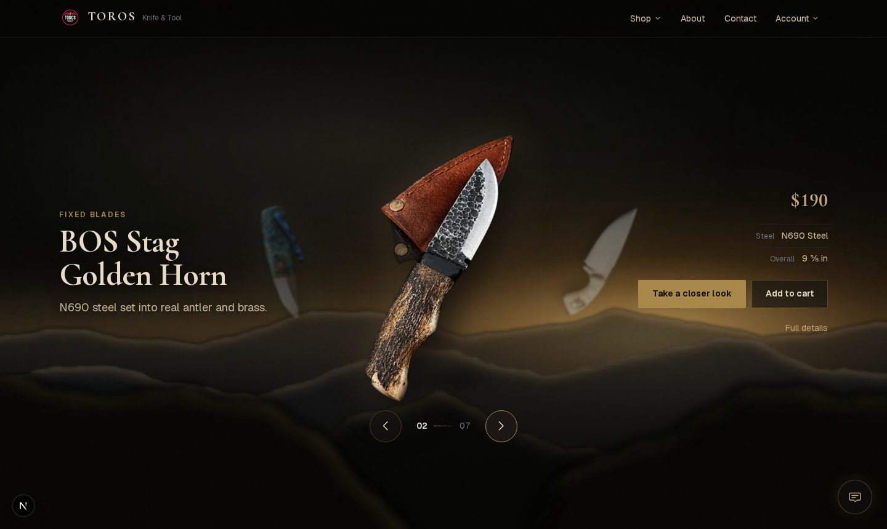
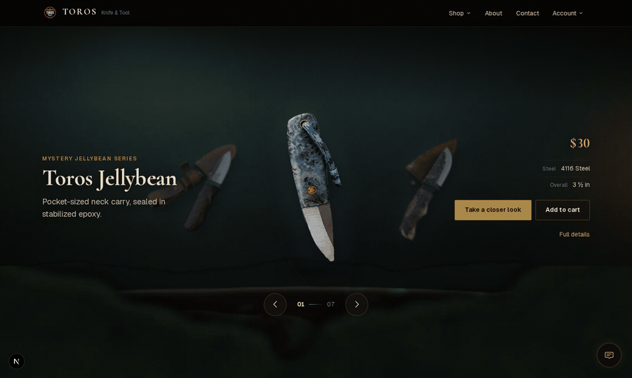
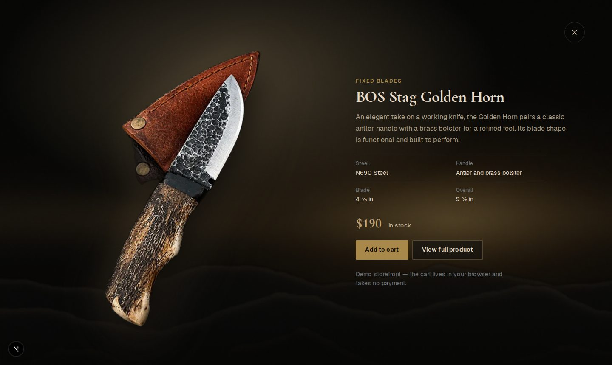
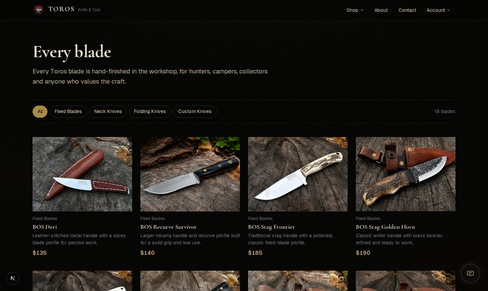
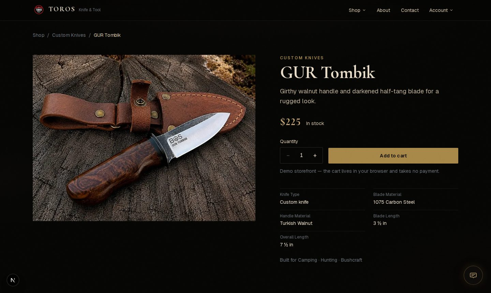
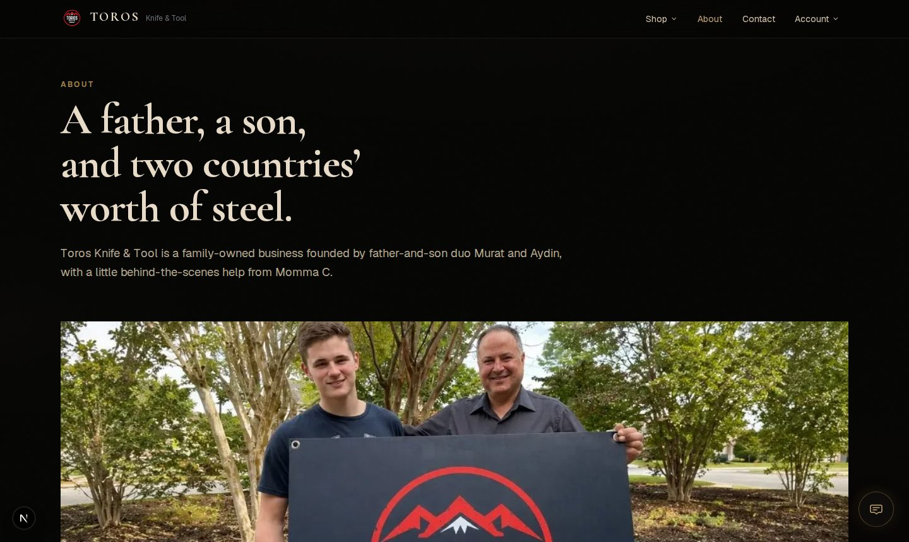

# Toros Knife & Tool

Premium e-commerce storefront for **Toros Knife & Tool** — handcrafted
Turkish-inspired blades built for American outdoor adventure.

The homepage opens on a seven-knife carousel where each knife stands inside its
own composited environment. The knives are masked photographs of the real
products; the worlds behind them are rendered.



**Seven knives, seven scenes** — the environment changes with the product, not
just the accent colour:



**The closer look** — a zoom into the same scene, not a modal on a black panel:



| Shop | Product detail |
| --- | --- |
|  |  |



## What's here

- A seven-knife homepage hero: manual navigation by arrows, side selection,
  drag/swipe and arrow keys. No autoplay. Each knife has its own layered scene,
  lighting direction and accent.
- An inspection state that animates the active knife from its carousel position
  into a full-viewport view of the same world, with focus trapping, scroll lock
  and `Escape`.
- Shop with real category filtering, product detail pages, About, Contact,
  mystery bag, and honest account/cart placeholders.
- A local demo cart behind a swappable `CommerceAdapter` seam
  (`lib/demo-cart.ts`). No payment is taken anywhere.
- `prefers-reduced-motion` support throughout: crossfades replace spatial
  travel, and shared-element transitions are dropped.

**Not included:** live checkout, authentication, inventory, or an email backend.

## Tech

- [Next.js 16](https://nextjs.org/) (App Router, Turbopack)
- React 19 + TypeScript (strict)
- Tailwind CSS v4
- [Framer Motion](https://www.framer.com/motion/)

Server Components by default; interactivity is isolated to small client
islands (the carousel, the dialog, the forms, the header menus).

## Getting started

```bash
npm install
npm run dev
```

Open [http://127.0.0.1:3004](http://127.0.0.1:3004) — `dev` uses port **3004**,
not 3000.

```bash
npm run lint       # eslint
npm run typecheck  # tsc --noEmit
npm run build      # production build
npm run start      # serve the production build
```

## Project structure

```
app/
├── layout.tsx              Root layout, fonts, header/footer
├── page.tsx                Homepage
├── globals.css             Design tokens, primitives, then per-area styles
├── shop/                   Catalogue + category filter
├── products/[slug]/        Product detail (statically generated)
└── about/ contact/ mystery-bag/ cart/ login/ register/

components/
├── Header.tsx  Footer.tsx  ProductCard.tsx  ProductGallery.tsx
├── home/
│   ├── Hero.tsx            Server wrapper — resolves the featured products
│   └── hero/               Carousel island, scenes, inspection, config
├── product/  shop/  about/  contact/  ui/

data/products.ts            The catalogue. Edit here.
lib/products.ts             Data access
lib/demo-cart.ts            Demo commerce adapter (no payment)
scripts/                    Asset pipelines (see below)
docs/                       Asset briefs and audits
```

## The design system

`app/globals.css` opens with a token layer — spacing, radii, borders, shadows,
motion tiers and a fluid type scale — followed by layout, typography, button,
link, media and form primitives. Pages compose those rather than styling
themselves. If you find yourself writing a new radius or a new font size, the
system is missing something; add it there.

The one small-caps label is `.eyebrow`, and a section gets an eyebrow *or* a
heading rule, not both.

## The hero

Configuration for all seven knives lives in one file:
`components/home/hero/hero-knives.ts`. Each entry pairs a slug (resolved
against the canonical catalogue) with staging data: the cutout, how it sits on
the stage, the accent, and the scene's three layers plus its light direction.
Adding a knife is a new entry there — never another branch in JSX or another
`[data-variant]` rule in CSS.

Scenes are composited in depth:

```
plate        far background: sky, wall, air
atmosphere   CSS haze tying the plate into the page
mid          middle ground: terrain, bench, anvil
key          the scene's directional light
── the knife ──
fore         near element, above the knife so it overlaps it
```

## Asset pipelines

All three are re-runnable and none of them redraws a product.

```bash
python3 scripts/build-hero-scenes.py [slug ...]   # environment plates
python3 scripts/build-hero-cutouts.py             # masked product cutouts
python3 scripts/normalize-product-photos.py       # 4:3 card frames
```

- **Scenes** are procedural: fractal terrain, directional light and material
  grain. No knife is ever drawn into a plate.
- **Cutouts** are masks over the real photographs — original pixels, nothing
  repainted.
- **Card frames** crop each photo to its content box and fill one 4:3 ratio.
  Pixels are only ever removed; nothing is stretched or upscaled.

See `docs/hero-scene-asset-brief.md` for what a photographic replacement plate
needs, `docs/product-photo-reshoot-list.md` for which sources are weak and why,
and `docs/photography-guide.md` for the shooting setup.

## Replacing placeholder product data

### 1. Edit product entries

`data/products.ts`. Each product supports:

| Field | Description |
|---|---|
| `name`, `slug`, `category`, `price` | Core listing info |
| `shortDescription`, `longDescription` | Card + detail copy |
| `images` | Image paths; defaults to `/images/products/{slug}/main.jpg` |
| `steel`, `handleMaterial`, `bladeLength`, `totalLength` | Specs |
| `bestUses`, `tags` | Use-case badges and filtering |
| `inStock`, `featured`, `customAvailable` | Availability flags |
| `checkoutUrl` | External checkout link (Shopify, Stripe, …) |
| `craftsmanshipStory`, `careInstructions` | Detail page content |

### 2. Add product photos

Put the original at `public/images/products/{slug}/main.jpg`, then run
`python3 scripts/normalize-product-photos.py` to derive the card frame. Read
`docs/photography-guide.md` first — the single biggest quality win available to
this project is shooting at a usable resolution.

If the product is also in the hero, add a transparent cutout at
`public/images/hero/knives/{slug}.png` and record its dimensions in
`components/home/hero/hero-knives.ts`.

## Connecting checkout

Do **not** build custom payment processing.

- **Shopify Buy Button** — set `checkoutUrl` per product; `AddToCartButton`
  renders a real checkout link automatically.
- **Shopify Storefront API** — add `SHOPIFY_STORE_DOMAIN` and
  `SHOPIFY_STOREFRONT_ACCESS_TOKEN`, then replace the `data/products.ts` reads.
- **Stripe** — create Payment Links and set `checkoutUrl`, or add an API route
  that creates Checkout Sessions server-side.

Either way, replace the demo adapter in `lib/demo-cart.ts` rather than working
around it.

## Brand colours

Defined in `app/globals.css`:

- **Black** `#060605` — page background (`--toros-black`)
- **Charcoal** `#0d0c0a` / **Surface** `#141210` — raised surfaces
- **Brass** `#a8894a`, light `#c4a574` — the one accent (`--toros-brass`)
- **Parchment** `#e8dcc8` / **Sand** `#d4c4a8` — body and heading text
- **Tan** `#9a8468` — secondary text
- **Oxblood** `#5c1a1f` — sparing

Each featured knife also contributes `--knife-accent` at runtime, sampled from
that knife's own materials.

## Known limitations

- Hero scene plates are rendered, not photographed —
  `docs/hero-scene-asset-brief.md`.
- Source photography is 900×1200 throughout; one product
  (`toros-ram-horn`) cannot fill the card frame without losing the knife —
  `docs/product-photo-reshoot-list.md`.
- `gur-tuva`'s recorded handle material contradicts its photograph. The record
  has not been guessed at — `docs/hero-product-audit.md`.
- No checkout, authentication, or email backend.

## License

Private — Toros Knife & Tool.
